
<pre align="center"><strong>@open-aviation |</strong> <a href="https://journals.open.tudelft.nl/joas/">Journal of Open Aviation Science</a> | <a href="https://aviationbook.netlify.app/">Book</a> | <a href="https://observablehq.com/@openaviation">Observable</a> | <a href="https://twitter.com/joaspub">Twitter</a></pre>

This organisation hosts several open projects, including:
- repositories supporting the [*Journal of Open Aviation Science*](https://journals.open.tudelft.nl/joas/);
- the source files to [*A journey through aviation data*](https://aviationbook.netlify.app/), an open-access book;
- [*pyopensky*](https://github.com/open-aviation/pyopensky) library for accessing OpenSky historical database;
- more open-sources projects related to aviation

Read also about aviation related stories supported by open-source code and data:\
https://observablehq.com/@openaviation

When you are lost in searching for open data, we have a curated list of open aviation data:\
https://open-aviation.github.io/atmdata/

## Open-Aviation Projects

[](https://github.com/open-aviation/aviationbook)
[](https://github.com/open-aviation/pyopensky)
[](https://github.com/open-aviation/fastmeteo)

[](https://github.com/open-aviation/pitot)

## Active Community Projects

### Software

[](https://github.com/AeroMAPS/AeroMAPS)
[](https://github.com/fast-aircraft-design/FAST-OAD)

### Libraries

[](https://github.com/xoolive/traffic)
[](https://github.com/junzis/openap)

[](https://github.com/junzis/openap-top)
[](https://github.com/junzis/pymodes)
[](https://github.com/xoolive/rs1090)
[](https://github.com/xoolive/datalink)
[](https://github.com/contrailcirrus/pycontrails)
[](https://github.com/achevrot/impunity)

